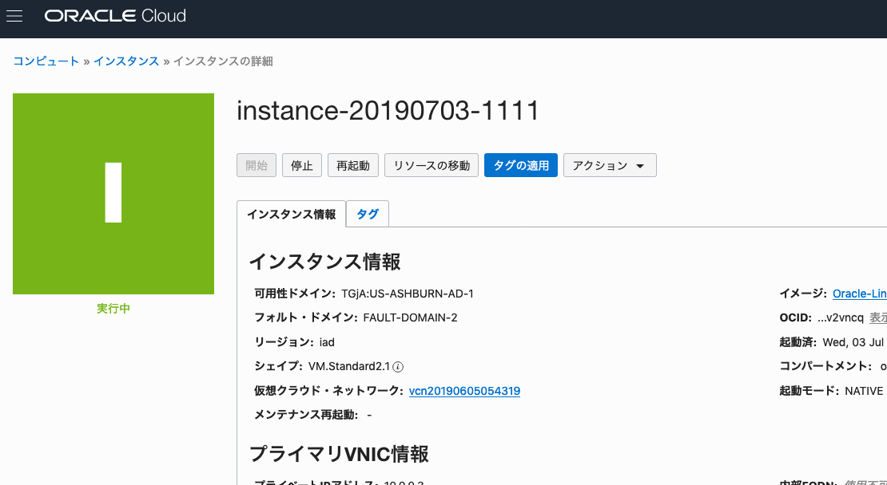
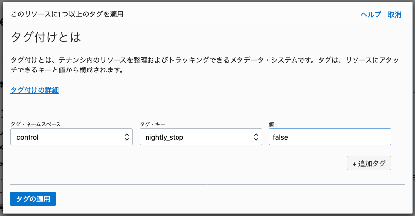
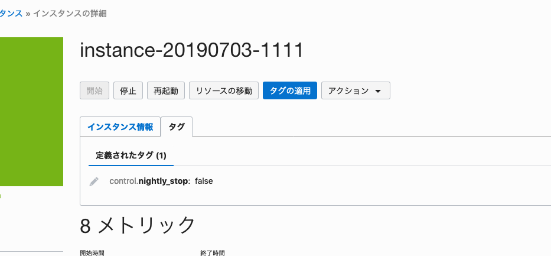
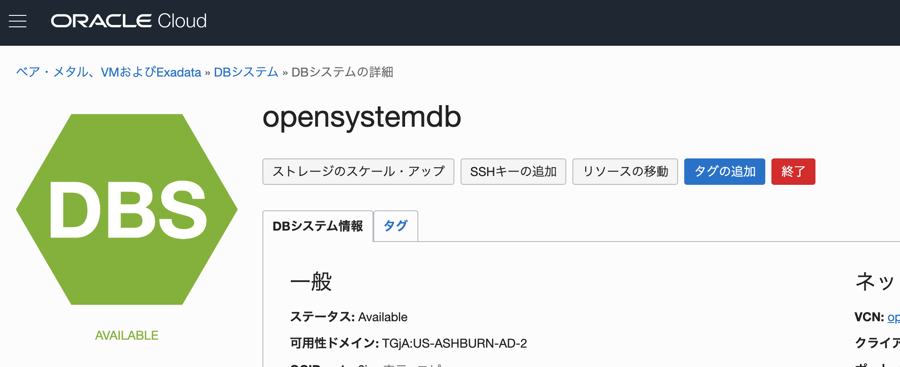
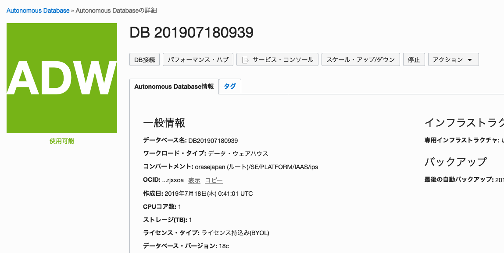

# 夜間にインスタンスを停止させないように設定する方法

2019/9/19(木)より、夜間に起動中のインスタンスは強制的に停止します。夜間に停止させたくないインスタンスがある場合には、このドキュメントの手順にしたがってタグを設定することで、停止対象から除外することができます。

停止は、毎晩22時に実行されます。一時的に停止対象から外したい場合も、この手順でタグを設定することで、インスタンスは夜間に停止しなくなります。タグを削除したり、値をfalse以外に設定することで、また夜間停止対象に戻すことができます。

### 夜間停止対象のインスタンス
- コンピュート・インスタンス
- データベース・システム
- ATPおよびADW インススタンス

## 各インスタンスのタグ設定方法

### コンピュート・インスタンス

1. OCIコンソールから、インスタンスの詳細画面を開きます

2. 青色の **タグの適用** ボタンを押します

    

3. 以下の情報を入力し、青色の **タグの適用** ボタンを押します
    - **タグ・ネームスペース** : *control* を選択
    - **タグ・キー** : *nightly_stop* を選択
    - **値** : *false* と入力

    

4. インスタンス詳細画面の **タグ** タブの中に、設定したタグ情報が表示されていることを確認します

    

5. 以上で設定は完了です

### データベース・システム

1. OCIコンソールから、データベース・システムの詳細画面を開きます

2. 青色の **タグの追加** ボタンを押します

    

3. 以下の情報を入力し、青色の **タグの適用** ボタンを押します
    - **タグ・ネームスペース** : *control* を選択
    - **タグ・キー** : *nightly_stop* を選択
    - **値** : *false* と入力

    

4. インスタンス詳細画面の **タグ** タブの中に、設定したタグ情報が表示されていることを確認します

5. 以上で設定は完了です

### ATPおよびADW インススタンス

1. OCIコンソールから、ATPまたはADWのインスタンス詳細画面を開きます

2. アクション メニューの中の、**タグの適用** ボタンを押します

    

3. 以下の情報を入力し、青色の **タグの適用** ボタンを押します
    - **タグ・ネームスペース** : *control* を選択
    - **タグ・キー** : *nightly_stop* を選択
    - **値** : *false* と入力

    

4. インスタンス詳細画面の **タグ** タブの中に、設定したタグ情報が表示されていることを確認します

5. 以上で設定は完了です
